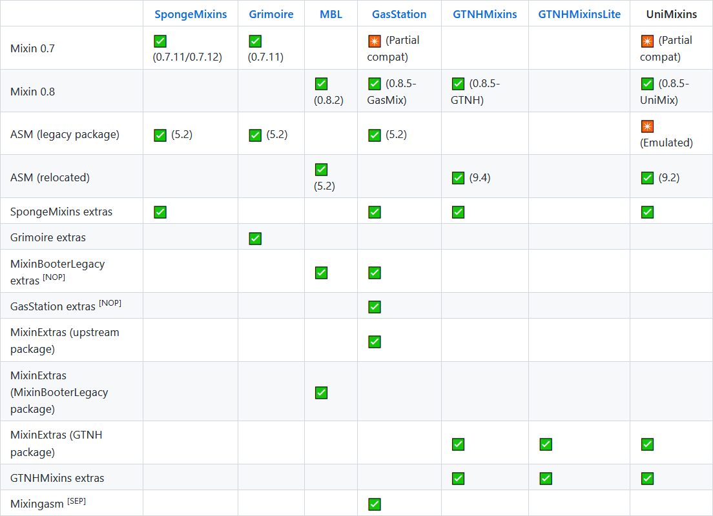
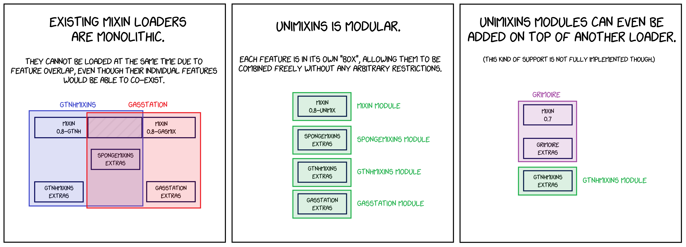

# UniMixins

UniMixins is a Mixin loader for Minecraft 1.7.10 (with partial 1.8.9~1.12.2 support) designed for maximum compatibility. It aims to combine the features of as many mixin loaders as possible, and its modular nature makes it possible to use along other loaders if desired.

## Background

Numerous Mixin loaders exist for 1.7.10, and each one provides a differing set of extra features we refer to as *"extras"* on top of providing Mixin.

Since each of these loaders is monolithic, different ones cannot be used at the same time due to unavoidable feature overlap. To avoid this problem, UniMixins offers each feature as a separate module (but a combined jar is still provided for convenience).

## Comparison table

Below is a table comparing the feature sets of known Mixin loaders.

Note: A more detailed version of this table is available [here](https://legacymoddingmc.github.io/wiki/comparison-of-1.7.10-mixin-loaders/).

<picture>
  <source srcset="docs/comparison-chart-dark.png" media="(prefers-color-scheme: dark)">
  
</picture>

* [NOP]: Does not do anything. [(issue)](https://github.com/FalsePattern/GasStation/issues/15)
* [SEP]: Is available as a separate mod.

## Usage

Download the `-all` jar, and put it in your mods directory. Remove any other conflicting Mixin loaders (refer to the above table).

> **Note**: It's important for the jar to be named so that it comes first alphabetically, to avoid [a sorting issue](https://github.com/tox1cozZ/mixin-booter-legacy/issues/1) with mods that embed Mixin. This is why the jar starts with a `+` character. You may need to change this to a `!` character if you encounter issues with renamed jars.
>
> For reference, here is the sorting order of some notable characters: `!` < `+` < `0` < `[` < `_` < `a`

### Advanced usage

You can also assemble your own combination of modules using the module jars. Some modules depend on other modules, see the **List of modules** section.

Assuming no other Mixin loaders are present, you will generally want the following modules:
* **Mixin** (any single fork)
* **Compat** and **Mixingasm** (optional but highly recommended)
* Modules providing any extras you need

The game will crash if modules are missing dependencies. This can be disabled in the config.

### Developer usage

See [docs/developer-usage.md](docs/developer-usage.md).

## List of modules

All modules depend on the Mixin module. Note that the dependents don't necessarily have to come from UniMixins modules, other mods may also be used to provide them.

### Included in `all`-jar

* **Mixin (UniMix)**: Provides [a Mixin fork](https://github.com/LegacyModdingMC/UniMix) maintained by the UniMixins developers, based on [the Fabric fork](https://github.com/FabricMC/Mixin).
* **SpongeMixins** [1.7.10 only]: Provides an emulation of [SpongeMixins](https://github.com/GTNewHorizons/SpongeMixins)'s extras.
* **MixinBooterLegacy** [1.7.10 only]: Provides an emulation of [MixinBooterLegacy](https://github.com/tox1cozZ/mixin-booter-legacy)'s extras, and a relocated MixinExtras.
* **MixinExtras**: Provides [MixinExtras](https://github.com/LlamaLad7/MixinExtras).
* ~~**GasStation**~~ [1.7.10 only]: Deprecated in 0.1.23; removed in 0.2.0.
* **GTNHMixins** [1.7.10 only]: Provides an emulation of [GTNHMixins](https://github.com/GTNewHorizons/GTNHMixins)'s extras, and a relocated MixinExtras.
    * Depends on SpongeMixins.
* **Compat**: Various compatibility tweaks:
    * Remaps invalid references to Mixin classes (specifically the shaded ASM) in mods.
    * Adds information about mixins to crash reports. [1.7.10 only]
* **Mixingasm**: Improves Mixin's compatibility with ASM transformers.

### Optional

* **Future Compat** [1.8.9+ only]: Makes many of the modules usable on 1.8.9+. **Needed to run the mod on 1.8+.** (Not needed for Mixingasm.)

### Very Optional

These are not included in releases, they mainly exist for testing purposes. (Note: You can only use a single Mixin module at the same time.)

* **Mixin (SpongePowered)**: Provides [the upstream fork](https://github.com/SpongePowered/Mixin) of Mixin.
* **Mixin (Fabric)**: Provides [the Fabric fork](https://github.com/FabricMC/Mixin) of Mixin.
* **Mixin (GTNH)**: Provides [the GTNH fork](https://github.com/GTNewHorizons/SpongePoweredMixin) of Mixin.

## FAQ

### Why another mixin loader? Haven't you seen that one xkcd strip?

Before UniMixins was created, there was far too much fragmentation among Mixin loaders on 1.7.10, with different mods requiring different incompatible loaders. This was partly due to conflicts between their developers, and partly because of technical reasons (the loaders were designed in a monolithic way, which invites incompatibility). This project has neither of those issues.

### Why are you using the Fabric fork of Mixin? Isn't this a Forge mod?

The Fabric fork of Mixin is more actively maintained than the upstream fork, and has some extra fixes. Most of the Fabric fork's changes are not Fabric-specific.

### What do the "extras" do anyway?

* SpongeMixins, Grimoire, MixinBooterLegacy, and GTNHMixins offer various ways to let you mix into the classes of non-coremods. (This is something Mixin does not natively support, since all of its phases occur before Forge discovers non-coremods and puts them on the classpath.)
    - **MixinBooterLegacy** and **GTNHMixins** add a "late" mixin phase that is fired right before the first mod construction event is dispatched. At this point all mods have been discovered.
    - **SpongeMixins** lets you manually add mods to the classpath early using their file names. An old, hacky solution.
    - We recommend new mods to use **GTNHMixins** as it's the most actively used and maintained option.
* **Mixingasm** fixes [a Mixin issue](https://github.com/SpongePowered/Mixin/issues/309) that breaks some ASM transformers due to Mixin altering how they are called.
* **MixinExtras** adds new Mixin features that allow mods to write less intrusive mixins.

### Mixin? mixin? SpongeMixins? SpongePowered? What's the difference?

* [Mixin](https://github.com/SpongePowered/Mixin): a Java library that lets you transform Java classes in a fluent way.
* [SpongePowered](https://spongepowered.org/): the organization that created Mixin (who also developed a modding API called Sponge).
* [mixin](https://github.com/SpongePowered/Mixin/wiki/Introduction-to-Mixins---Understanding-Mixin-Architecture#4-only-you-mixins-can-save-mankind): a special Java class defining a "change" that should be applied to a class. These get applied by Mixin.
* [SpongeMixins](https://github.com/TimeConqueror/SpongeMixins): a Mixin loader created by TimeConqueror that has a very generic name.

## Contributing

When editing the source code of modules, please document your changes in the module's CREDITS file. This allows people to easily see what we have changed, and lets other developers know what changes they have to keep in mind when syncing with upstream.

The project needs to be compiled using Java 8. For example: `JAVA_HOME=/path/to/jdk8 ./gradlew build`

### Useful commands

* `./gradlew module-XXX:build`: builds the module named XXX

### Build flags
* `-Plocal`: use the locally built version of `unimix` when building the Mixin module.
    * Invoke `./gradlew publishToMavenLocal` in the UniMix repo first to install a local build.
* `-PenableAltMixin`: build alternate flavors of the Mixin module, not just UniMix.

### Roadmap

A rough roadmap of the project is available [here](https://gist.github.com/makamys/5eaf2ebb878b74213630eae122460f00).

### Test cases

See [docs/testing.md](docs/testing.md) for a list of mods we have used to test the functionality of various UniMixins modules.

## License

UniMixins is licensed under the Unlicense, with the exception of some modules. See [LICENSE](LICENSE) for the full details.
